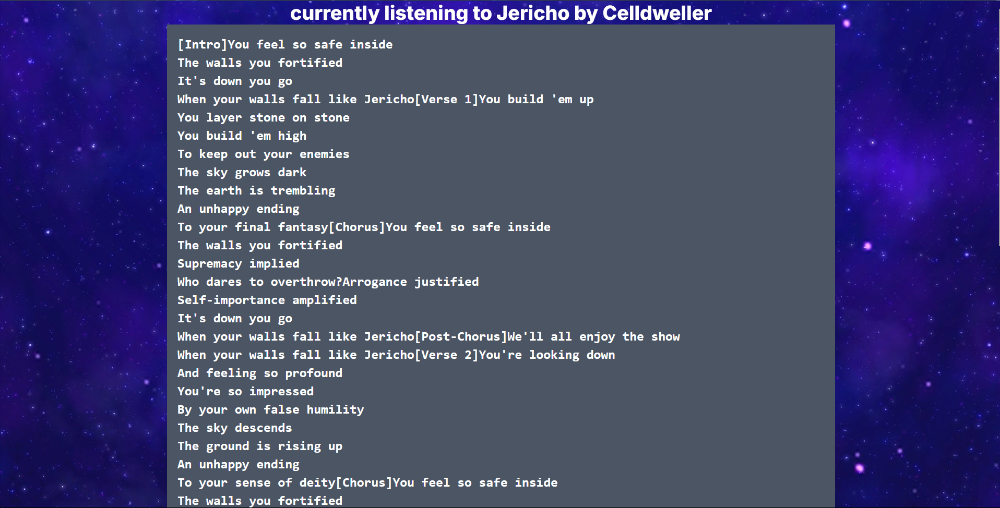
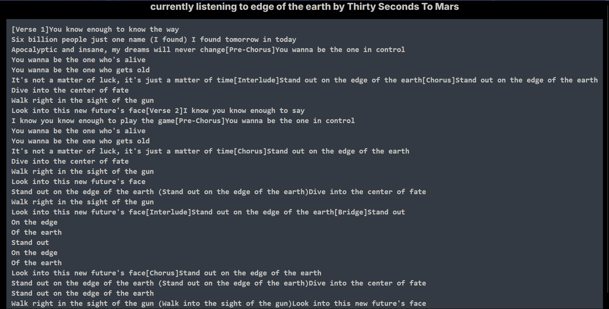

# Spotify synchroniser
### spotify stopped providing lyrics to broke people, so i decided to make my own interface which will do it instead.
also made an api to scrape lyrics from genius :)

this project has two parts-

1. a page where user can ask for a song's lyrics with song name and artist and a scraper fetches it
2. a spotify sync page where users can authenticate themselves and authorize my spotify app by initiating authorization flow with pkce. This works like this :
   my server creates a code verifier and hashes it and makes a code challenge.
   codeverifier is stored in cookie, an authorization url is created after which my web app redirects it to spotify's authentication and authorization page with all these parameters - myclientid, response type, redirect url, state, scope, code challenge, and code challenge method i.e sha256
   my app recieves the callback and then makes a post request to spotify's token endpoint and then spotify sends an access token and a refresh token back
3. the users are then redirected to a page where the lyrics of the song they are currently listening to is fetched and displayed from the lyrics fetching endpoint

### currently deployed at https://lyrical-eta.vercel.app/

